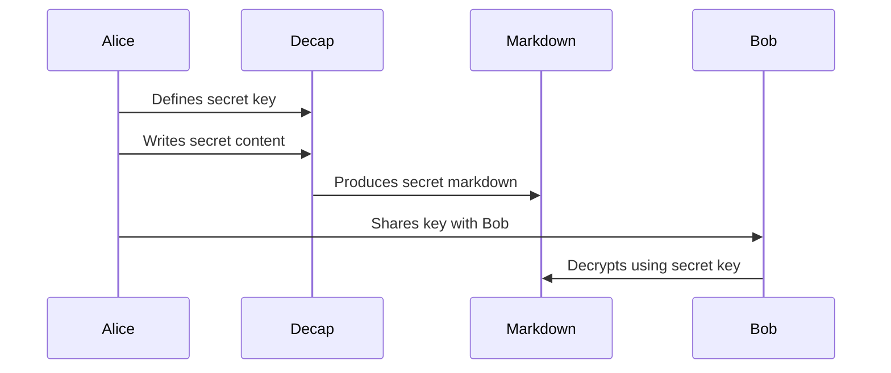

<h1 align='center'>decap-contrib-encrypted-widget</h1>

<br />
<p align='center'><i>A DecapCMS widget for producing secret content.</a> development, powered with Vite.</i></p>

## About

This widget allows the use of the `encrypted` widget that encrypts a secret using a symmetric-key algorithm.



### Quick Start

```bash
yarn install
yarn run dev
```

### Developing Widget

> More details about writing codes in widgets, you can read this [official doc](https://decapcms.org/docs/custom-widgets/#writing-custom-widgets-as-a-separate-package).

The whole project is focused on the `src/main.js`, the only entry which will mount your customized "Control" and "Preview" components on the `window`, so after `main.js` is bundled, you can call `CMS.registerWidget` to register your widget like this:

```html
<script src="./main.js"></script>
<script>
    // the "CMS" is exposed by "decap-cms-app"
    CMS.registerWidget('test', window.StarterControl, window.StarterPreview);
</script>
```

> Remember to rename "StarterControl" and "StarterPreview" to your own widget name !

When project started, the `public/config.yml` will be read to setup CMS environment, so you can add a more complicate collection for your usage.

### Testing Widget

> Before testing in "Preview mode", please build files first.

If you want to test your built widget file, you can start a "Preview" mode via `npm run preview`, that will serve files in the `dist` folder. 

### Production & Publishing Widget

```bash
yarn run build
# npm version release
# npm run publish
```

### Questions

If you have any questions, please leave me an issue, thanks~